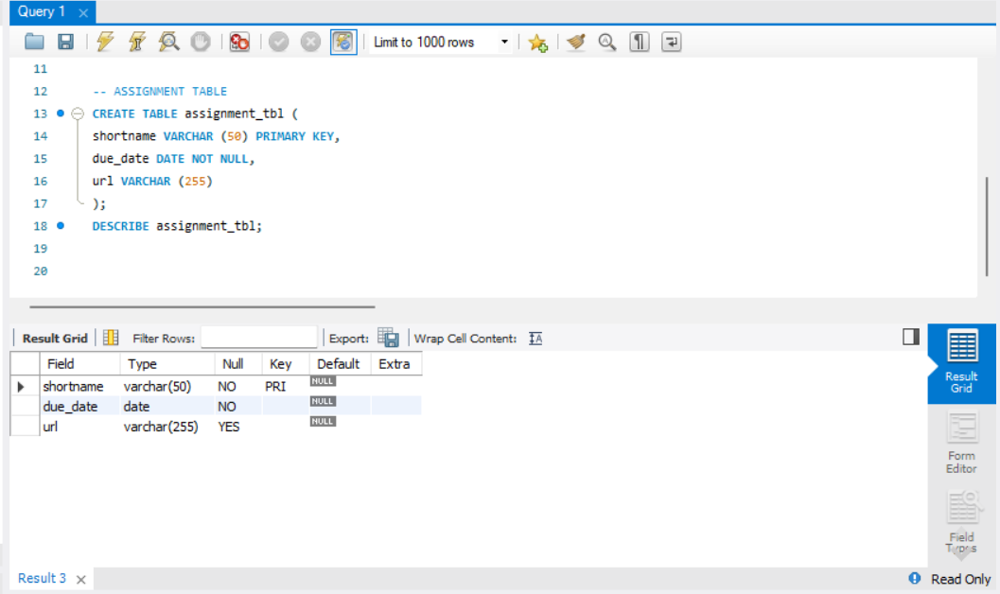

For this task, we are given an ER diagram representing student assignment submissions, which we need to convert into MySQL tables.

Here’s the Query Statements

Fisrt, a command that create a database as the active database, so subsequent SQL operations will be performed within that specific database.
CREATE DATABASE student_submissions;
USE student_submissions;
### Student Query Statements
CREATE TABLE students (
    username VARCHAR(50) PRIMARY KEY
);
### Assignment Query Statements
CREATE TABLE assignments (
    shortname VARCHAR(50) PRIMARY KEY,
    due_date DATE NOT NULL,
    url VARCHAR(255)
);
### Submission Query Statements
CREATE TABLE submission (
    username VARCHAR(50),
    shortname VARCHAR(50),
    version INT,
    submit_date DATE NOT NULL,
    data TEXT,
    PRIMARY KEY (username, shortname, version),
    FOREIGN KEY (username) REFERENCES students(username),
    FOREIGN KEY (shortname) REFERENCES assignments(shortname)
);

Here's the screenshot of Table Structure (See screenshots)

### Student table

  

### Assignment table

  

### Submission table

  

Here's the ER Diagram or Relational Schema

