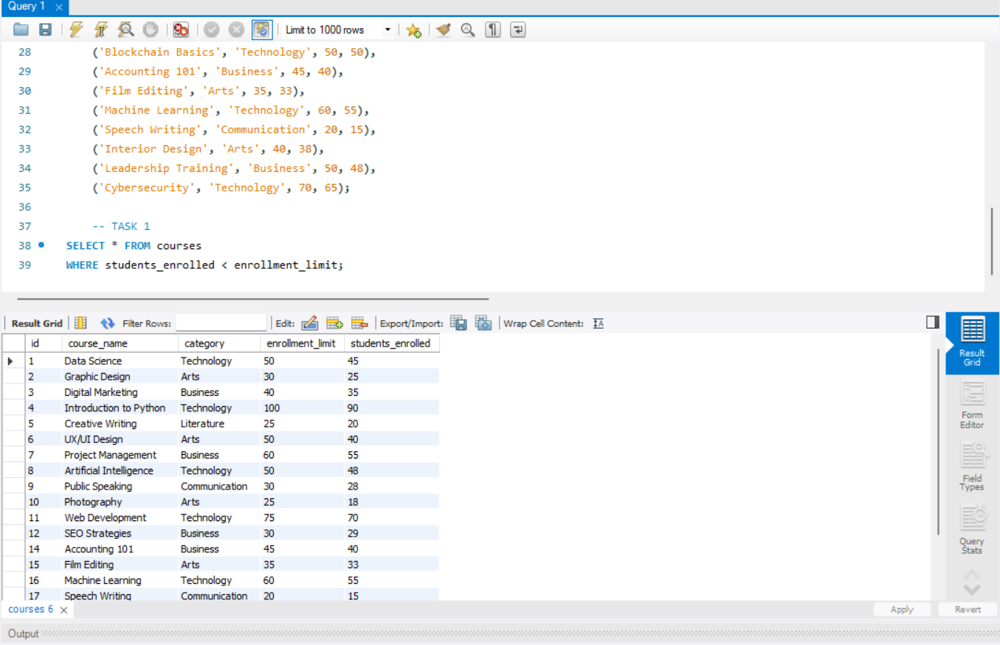
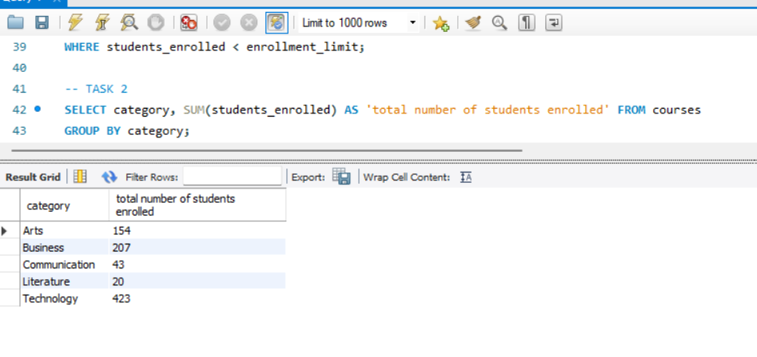
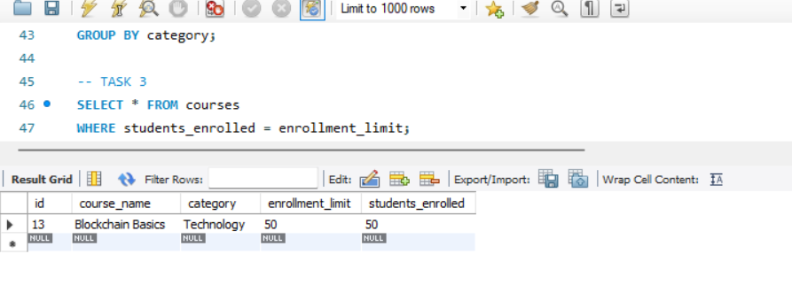
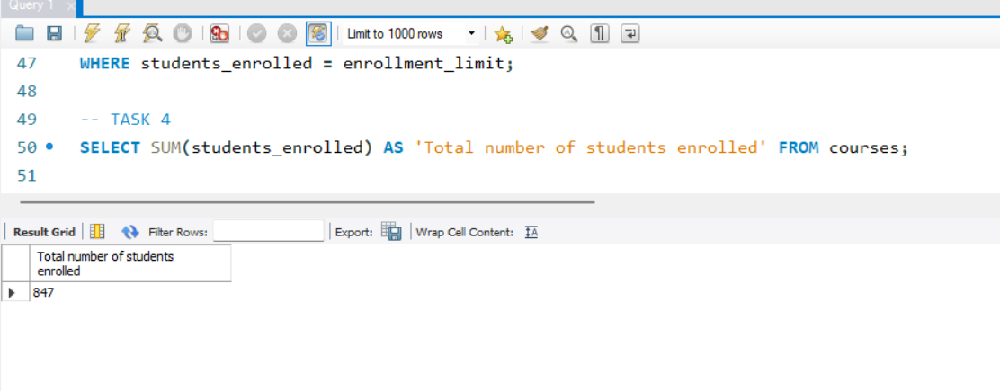
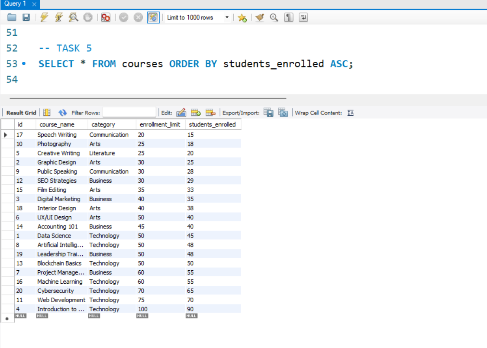
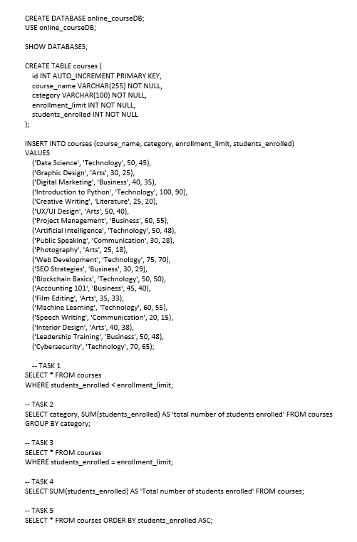

# Finals Lab Task 3.1: Using SELECT CLAUSE
For this task, we are given initial query then perform the SELECT statements required for each problems. To use a SELECT clause in order to specify the names of the fields that have data that want to use in a query. 

## Here’s the Query Statements

Fisrt, a command that create a database, so subsequent SQL operations will be performed within that specific database.
```sql
CREATE DATABASE online_courseDB;
USE online_courseDB;

SHOW DATABASES;

CREATE TABLE courses (
    id INT AUTO_INCREMENT PRIMARY KEY,
    course_name VARCHAR(255) NOT NULL,
    category VARCHAR(100) NOT NULL,
    enrollment_limit INT NOT NULL,
    students_enrolled INT NOT NULL
);

INSERT INTO courses (course_name, category, enrollment_limit, students_enrolled)
VALUES
    ('Data Science', 'Technology', 50, 45),
    ('Graphic Design', 'Arts', 30, 25),
    ('Digital Marketing', 'Business', 40, 35),
    ('Introduction to Python', 'Technology', 100, 90),
    ('Creative Writing', 'Literature', 25, 20),
    ('UX/UI Design', 'Arts', 50, 40),
    ('Project Management', 'Business', 60, 55),
    ('Artificial Intelligence', 'Technology', 50, 48),
    ('Public Speaking', 'Communication', 30, 28),
    ('Photography', 'Arts', 25, 18),
    ('Web Development', 'Technology', 75, 70),
    ('SEO Strategies', 'Business', 30, 29),
    ('Blockchain Basics', 'Technology', 50, 50),
    ('Accounting 101', 'Business', 45, 40),
    ('Film Editing', 'Arts', 35, 33),
    ('Machine Learning', 'Technology', 60, 55),
    ('Speech Writing', 'Communication', 20, 15),
    ('Interior Design', 'Arts', 40, 38),
    ('Leadership Training', 'Business', 50, 48),
    ('Cybersecurity', 'Technology', 70, 65);
   
```

### TASK 1
```sql
SELECT * FROM courses
WHERE students_enrolled < enrollment_limit;

```
### TASK 2
```sql
SELECT category, SUM(students_enrolled) AS 'total number of students enrolled' FROM courses
GROUP BY category;
```

### TASK 3
```sql
SELECT * FROM courses
WHERE students_enrolled = enrollment_limit;
```

### TASK 4
```sql
SELECT SUM(students_enrolled) AS 'Total number of students enrolled' FROM courses;
```

### TASK 5
```sql
SELECT * FROM courses ORDER BY students_enrolled ASC;
```

## Here's the screenshot of the whole Query Statements and Table Structure (See screenshots)

### TASK 1



### TASK 2



### TASK 3



### TASK 4



### TASK 5



## SQL copy of the database and table structures


