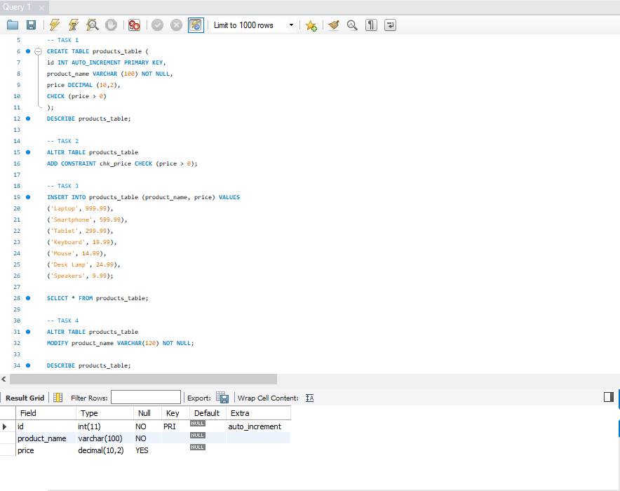
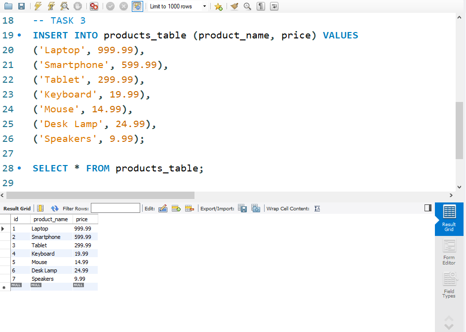

# Finals Lab Task 3. Table Manipulation
This task involves creating and managing a product database using MySQL. You are required to follow a step-by-step approach to perform operations such as table creation, data insertion, and schema modification.

## Here’s the Query Statements

Fisrt, a command that create a database, so subsequent SQL operations will be performed within that specific database.
sql
CREATE DATABASE product_db;

USE product_db;

### TASK 1
```sql
CREATE TABLE products_table (
id INT AUTO_INCREMENT PRIMARY KEY,
product_name VARCHAR (100) NOT NULL,
price DECIMAL (10,2),
CHECK (price > 0)
);
```
### TASK 2
```sql
ALTER TABLE products_table
ADD CONSTRAINT chk_price CHECK (price > 0);
```
### TASK 3
```sql
INSERT INTO products_table (product_name, price) VALUES
('Laptop', 999.99),
('Smartphone', 599.99),
('Tablet', 299.99),
('Keyboard', 19.99),
('Mouse', 14.99),
('Desk Lamp', 24.99),
('Speakers', 9.99);

SELECT * FROM products_table;
```
### TASK 4
```sql
ALTER TABLE products_table
MODIFY product_name VARCHAR(120) NOT NULL;

DESCRIBE products_table;
```
Here's the screenshot of whole Query Statements ture (See screenshots)

### Query Statements


### Product Table
  


Here's the screenshot of ER Diagram or Relational Schema (See screenshots)

### ER Diagram or Relational Schema


