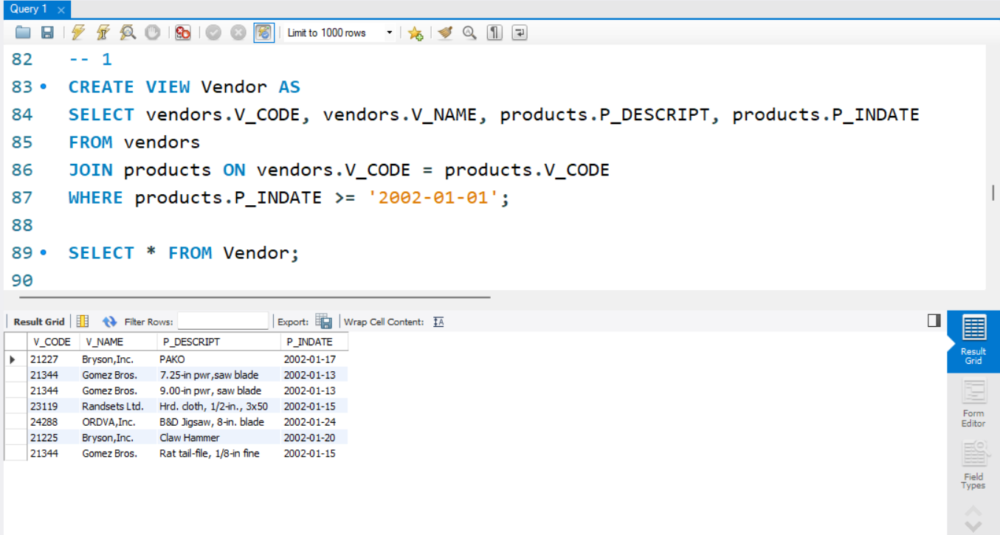
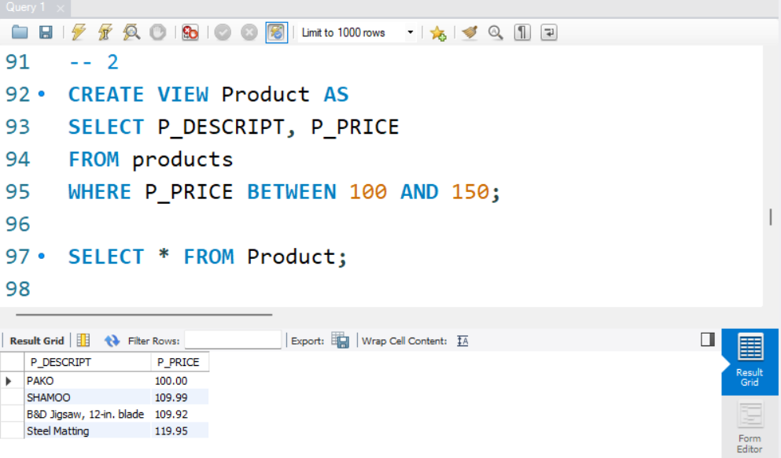
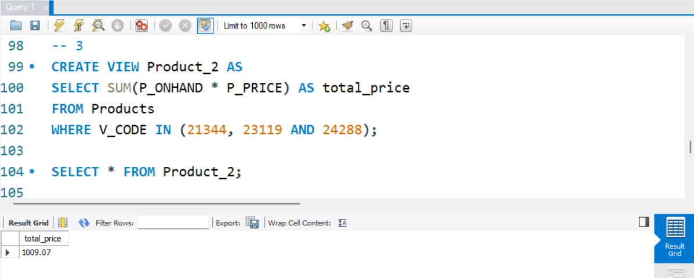
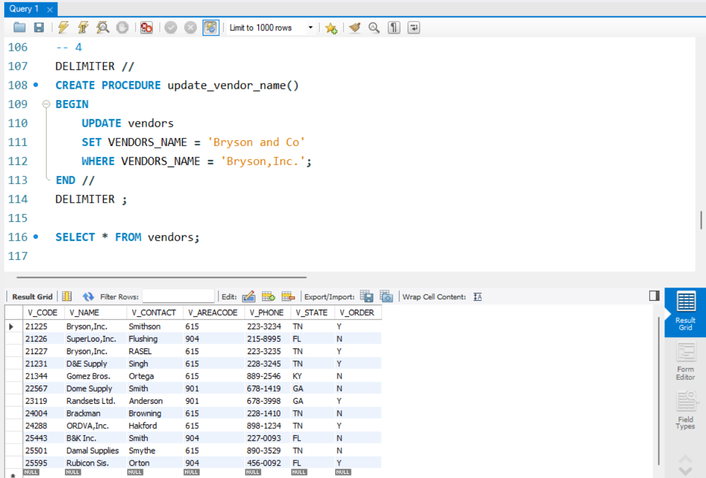
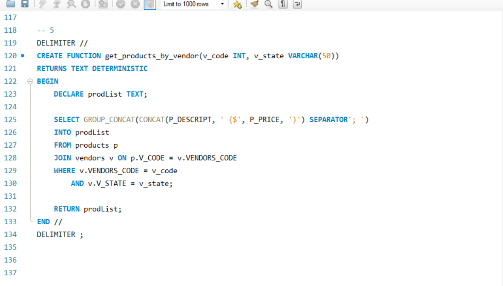

# Final Lab Task 5: Using SQL Views and Stored Procedures and Stored Functions
For this task, we are given initial query creates reusable views, procedures, and functions to simplify querying and updating product and vendor data in the inventory database.

## Here’s the Query Statements

### TASK 1
```sql

CREATE VIEW Vendor AS
SELECT vendors.V_CODE, vendors.V_NAME, products.P_DESCRIPT, products.P_INDATE
FROM vendors
JOIN products ON vendors.V_CODE = products.V_CODE
WHERE products.P_INDATE >= '2002-01-01';

SELECT * FROM Vendor;
```
### TASK 2
```sql

CREATE VIEW Product AS
SELECT P_DESCRIPT, P_PRICE
FROM products
WHERE P_PRICE BETWEEN 100 AND 150;

SELECT * FROM Product;
```
### TASK 3
```sql

CREATE VIEW Product_2 AS
SELECT SUM(P_ONHAND * P_PRICE) AS total_price
FROM Products
WHERE V_CODE IN (21344, 23119 AND 24288);

SELECT * FROM Product_2;
```
### TASK 4
```sql
DELIMITER //
CREATE PROCEDURE update_vendor_name()
BEGIN
	UPDATE vendors
    SET VENDORS_NAME = 'Bryson and Co'
    WHERE VENDORS_NAME = 'Bryson,Inc.';
END //
DELIMITER ;

SELECT * FROM vendors;
```
### TASK 5
```sql

DELIMITER // 
CREATE FUNCTION get_products_by_vendor(v_code INT, v_state VARCHAR(50))
RETURNS TEXT DETERMINISTIC
BEGIN
	DECLARE prodList TEXT;
    
    SELECT GROUP_CONCAT(CONCAT(P_DESCRIPT, ' ($', P_PRICE, ')') SEPARATOR'; ')
    INTO prodList
    FROM products p
    JOIN vendors v ON p.V_CODE = v.VENDORS_CODE
    WHERE v.VENDORS_CODE = v_code
		AND v.V_STATE = v_state;
	
    RETURN prodList;
END //
DELIMITER ;

```
### It is how to run the function after creating it.
SELECT get_products(21344, 'KY');

## Here's the screenshot of the whole Query Statements and Table Structure (See screenshots)

### TASK 1



### TASK 2



### TASK 3



### TASK 4



### TASK 5



